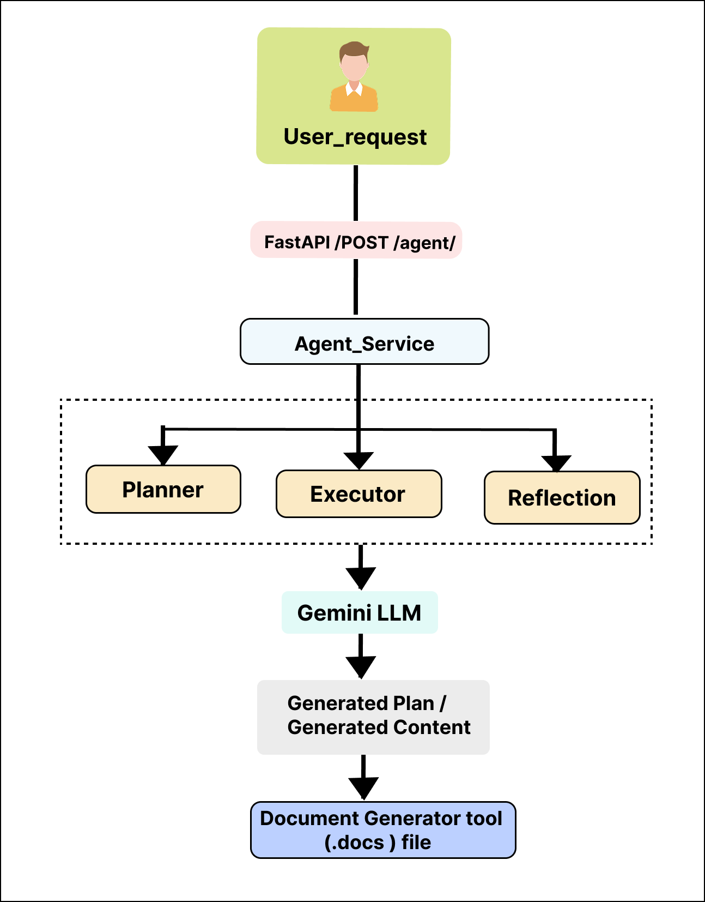

# Autonomous AI Agent

## Project Overview

This project is a simple Autonomous AI Agent built using Python and FastAPI.

The agent accepts a natural language request from the user, creates its own execution plan, executes each task using a Large Language Model (Gemini), performs a self-check (Reflection), and generates a Microsoft Word (.docx) document as the final output.

The project demonstrates autonomous planning, decision-making, tool orchestration, and end-to-end execution.

---

## Features

- Accepts natural language requests through a FastAPI API.
- Automatically creates an execution plan.
- Generates its own task/TODO list.
- Executes each task using Gemini.
- Performs a Reflection (Self-check) before generating the document.
- Generates a Microsoft Word (.docx) document.
- Returns the generated document path along with the execution details.

---

## Technologies Used

- Python
- FastAPI
- Gemini API
- Pydantic
- python-docx
- python-dotenv

---

## Project Structure

```
autonomous-agent/
│
├── agent/
│   ├── llm.py
│   ├── planner.py
│   ├── executor.py
│   └── reflector.py
│
├── models/
│   └── request_model.py
│
├── routers/
│   └── agent_router.py
│
├── services/
│   └── agent_service.py
│
├── tools/
│   └── document_tool.py
│
├── utils/
│   └── config.py
│
├── generated_docs/
│
├── main.py
├── requirements.txt
└── README.md
```

---

## API Endpoint

### POST /agent

### Request

```json
{
    "request": "Create a project proposal for an AI-powered customer support chatbot for a hospital."
}
```

### Sample Response

```json
{
    "goal": "Create AI Chatbot Proposal",
    "tasks": [
        "Write Executive Summary",
        "Describe Proposed Solution",
        "Design Technical Architecture",
        "Create Implementation Plan",
        "Write Conclusion"
    ],
    "review": "PASS",
    "document": "generated_docs/create_ai_chatbot_proposal.docx"
}
```

---

## Agent Workflow

<p align="center">
  
</p>


---

## Engineering Improvement

### Reflection (Self-check)

After executing all planned tasks, the agent performs a Reflection step.

The Reflection component reviews the generated content and verifies whether the document is complete before generating the final Microsoft Word document.

This improves the reliability of the generated output and demonstrates autonomous decision-making.

---

## How to Run

### 1. Create Virtual Environment

```bash
python -m venv .venv
```

### 2. Activate Virtual Environment

Windows

```bash
.venv\Scripts\activate
```

### 3. Install Dependencies

```bash
pip install -r requirements.txt
```

### 4. Configure Environment Variables

Create a `.env` file.

```
GEMINI_API_KEY=YOUR_GEMINI_API_KEY
```

### 5. Start the Server

```bash
python -m uvicorn main:app --reload
```

Open

```
http://127.0.0.1:8000/docs
```

---

## Example Test Inputs

### Standard Business Request

```json
{
    "request": "Create a professional project proposal for an AI-powered customer support chatbot for a hospital."
}
```

### Complex Request

```json
{
    "request": "Create a Software Requirements Specification (SRS) document for an AI-based Leave Management System. Some requirements are intentionally missing. Make reasonable assumptions and clearly mention them."
}
```

---

## Output

The generated Microsoft Word document is saved inside the `generated_docs` folder.

Example:

```
generated_docs/
    create_ai_chatbot_proposal_20260701_181530.docx
```

---

## Future Improvements

- Conversation Memory
- RAG (Retrieval-Augmented Generation)
- Async task execution
- Download API for generated documents
- Database integration using SQLAlchemy
- Multi-agent architecture